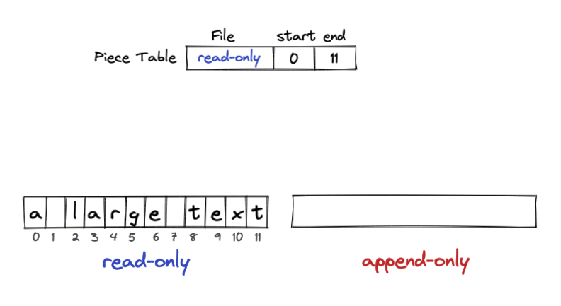
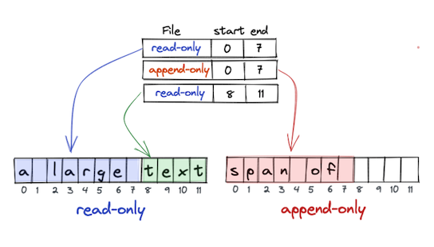
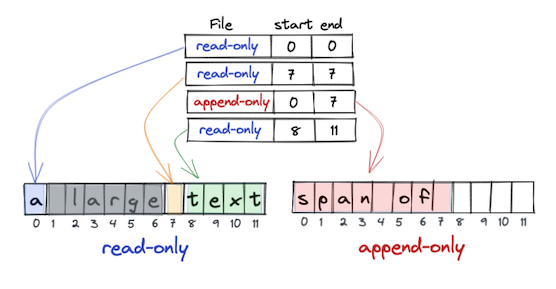

# piecetable

[](https://github.com/naotsugu/jpa-fluent-query/actions/workflows/gradle-build.yml)


Piece table data structure in Java.


## Operations

### Initial state

A piece table consists of three columns:

* Which buffer
* Start index in the buffer
* Length in the buffer

In addition to the table, two buffers are used to handle edits:

* `read-only` : A buffer to the original text document
* `append-only` : A buffer to a temporary file




### Insert

Inserting characters to the text consists of:

* Appending characters to the `read-only` buffer, and
* Updating the entry in piece table (breaking an entry into two or three)




### Delete

Single character deletion can be one of two possible conditions:

* The deletion is at the start or end of a piece entry, in which case the appropriate entry in piece table is modified.
* The deletion is in the middle of a piece entry, in which case the entry is split then one of the successor entries is modified as above.




## Usage

Add dependencies.

```kotlin
dependencies {
    implementation("com.mammb:piecetable:0.5.3")
}
```

There are three classes.

- PieceTable - Plain piece table implantation by bytes
- Document - Text manipulation with row-column number and charset infer
- TextEdit - Advanced text editing abstraction, with undo/redo

Use `TextEdit` in most cases.


### PieceTable

```java
var pt = PieceTable.of();

pt.insert(0, "a large text".getBytes());
pt.insert(8, "span of ".getBytes());
pt.delete(1, 6);

var bytes = pt.get(0, (int) pt.length());
assertEquals("a span of text", new String(bytes));
```


### TextEdit

```java
var doc = Document.of();

doc.insert(0, 0, "a large text"); // row:0 col:0
doc.insert(0, 8, "span of ");     // row:0 col:8
doc.delete(0, 1, 6);              // row:0 col:1

var text = doc.getText(0);        // get the text of row:0
assertEquals("a span of text", text);
```


To load an existing file, use the following

```java
var path = Path.of("sample.txt");
var doc = Document.of(path);
```


The charset is inferred from the loaded file, but can also be specified explicitly.

```java
var doc = Document.of(path, Charset.forName("xxx"));
```

`CharsetMatch` can also be used to customize charset infer.

```java
CharsetMatch customCharsetMatch = // ...
var doc = Document.of(path, customCharsetMatch);
```

### TextEdit

```java
var edit = TextEdit.of();

edit.insert(0, 0, "a large text");
edit.insert(0, 8, "span of ");
edit.delete(0, 1, 6);
assertEquals("a span of text", edit.getText(0));

edit.undo();
assertEquals("a large span of text", edit.getText(0));

edit.redo();
assertEquals("a span of text", edit.getText(0));
```


## How to run the example application

```shell
./gradlew build
cd examples/fx-editor
./gradlew run
```


## Sample applications using this library

* [min-editor](https://github.com/naotsugu/min-editor)([version 0.4.0](https://github.com/naotsugu/piecetable/tree/release-0.4) is used)


